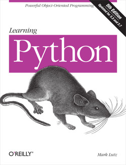
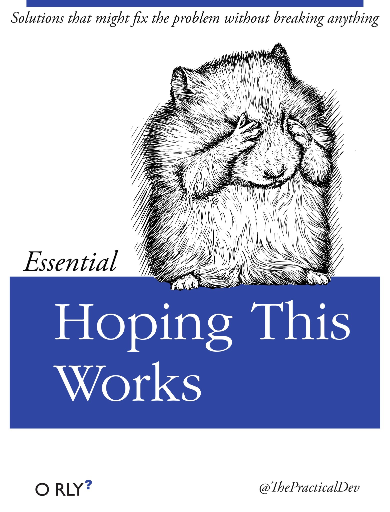
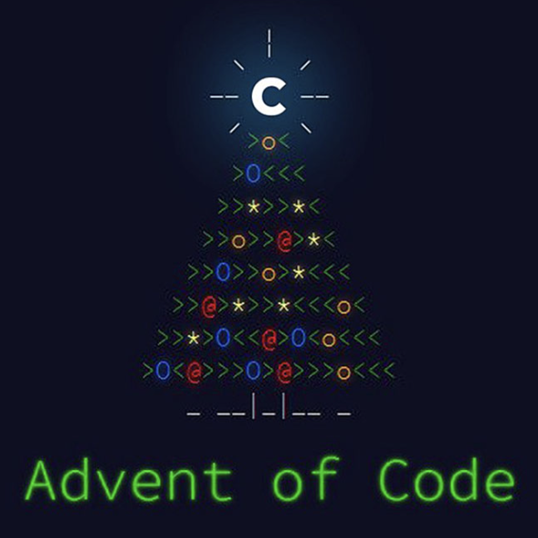

# QND Computer Science Club Day 10
Mark Schmidt

--- 

# Agenda

- Semester Recap
- Independent Learning
- Advent of Code

---

# Semester Recap

- 2D Games with KaboomJS
- ChatGPT
- Image Generation
- Cryptography

---

# Independent Learning

- Books
- Online Courses
- Other

---

# Books

- Oreilly is a GREAT publisher
- Write code out a line at a time
- Can be hard to find help if you get stuck

--- 

---

# Online Courses

- Codecademy
- Khan Academy
- Coursera
- code.org
- Many, many, many more
- Integrated environments, easy to ask for help
- Can sometimes be harder to learn from

---

# Other

- Leetcode
  - Mainly for interview prep
- Advent of Code

---

# Advent of Code

- One programming puzzle a day during Advent
- Puzzles get harder as you go
- VERY hard puzzles at the end
- You can complete past years whenever!
- Fun Christmas theme
- LOTS of solutions and help online!

---

# Advent of Code

- Each puzzle gives you a unique data set
- Use whatever programming language you want
- Sample input and solution given
- Part 2 is a little harder

