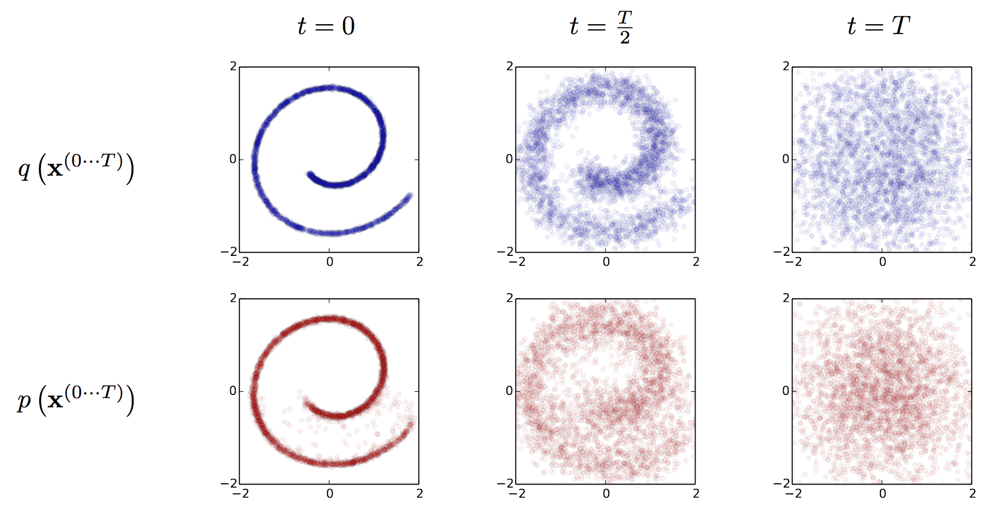
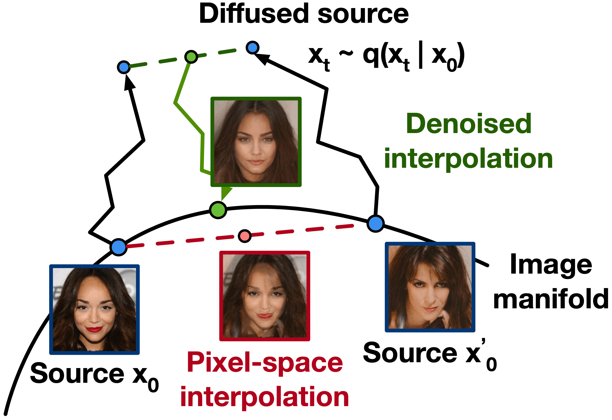
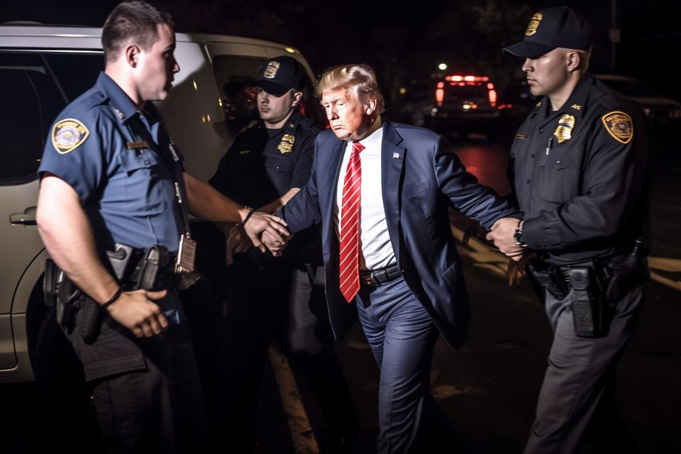
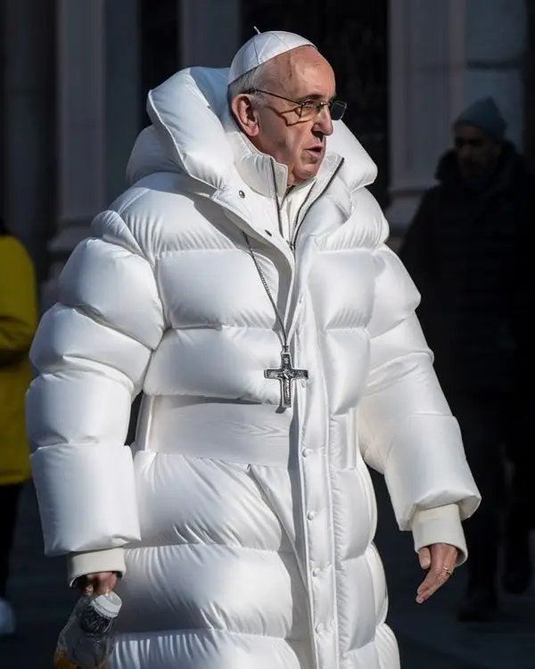
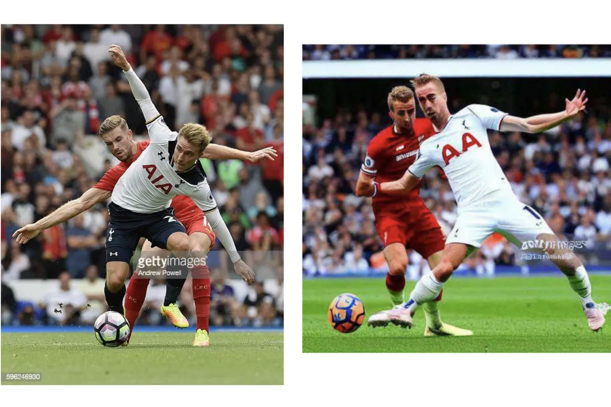

# QND Computer Science Club Day 7
Mark Schmidt

--- 

# Agenda

- ChatGPT recap
- Image generation

---

# Recap

---

# Image Generation

- Turn text into an image
- Process called Diffusion

---

# Available Models

- OpenAI -> DALLE-2
- StablityAI -> Stable Diffusion
- Midjourney
- Google - Imagen (private)
- Some can run on a laptop!

---

# How does Diffusion work?

- Very, very complex
- Go to college

---

# Diffusion

 

---

# Societal Issues

- Misinformation

---

# Misinformation

- SWAG POPE
- How to identify?

---

# Legal Issues

- Is this copyright infringement?

---

# Discussion

- Should this be allowed?
- What biases are baked in?

---

# Demo

---

# Using DALLE-2 in code

