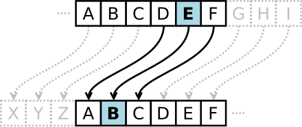

# QND Computer Science Club Day 8
Mark Schmidt

--- 

# Agenda

- Image Generation recap
- A History Lesson
- Codebreaking
- NO CLUB NEXT WEEK

---

# Recap

- Last week, the RNC put out an AI generated ad!
- The problems are already here!!!

---

# Cryptography

- The study of secrets
- Crucial to the functioning of the Internet
- The same algorithms are used for cryptocurrencies!

---

# History

- You are a Roman general
- You need to alert your compatriots that you are attacking at dawn
- How do you ensure it isn't intercepted?

---

# Ciphers

- Encode the message using a cipher
- Send the encoded message
- Recipient decodes, revealing the original message

---

# Caesarian Cipher

- Simplest possible cipher
- Shift each letter by a fixed offset

---

# Example

- Message: `ATTACK AT DAWN`
- Offset: 3
- Encoded: `DWWDFN DW GDZQ`

---

# Breaking the Code

- Look for short words
- Look for common letters
    - Frequency analysis
- Look for repeated words
- Brute force it (25 possibilities)

---

# More Complexity

- Use a different offset for each letter
- Use a different offset for each word
- Breaking becomes more difficult
- Brute forcing by hand is infeasible

---

# Enigma Machine

- Fast forward to WWII
- Nazis use Enigma to encode messages
- Breaking Enigma was crucial to the war effort
- Problem: Enigma has 158 quintillion settings

---

# Alan Turing

- British mathematician
- At Bletchley Park, developed the Bombe machine, which could break Enigma
- Won the war for the Allies

---

# Turing's Legacy

- Developed general purpose computing
- Founder of computer science
- Directly leads to the computers we use today
- In 1952, convicted of homosexual acts
- Chemically castrated by the British government
- Committed suicide

---

# Coding Today

- Let's write a program that encodes/decodes Caesar cipher